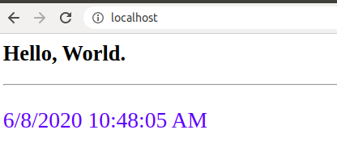

#### Run the NGINX via Docker Compose
    # Make sure that you're under /nginx-demo/1. Create Virtual Host
    $ docker-compose up -d # -d to detached the process to your terminal
      Creating sdc-nginx ... done
    $ docker ps
      CONTAINER ID        IMAGE                   COMMAND                  CREATED             STATUS              PORTS                NAMES
      ae0f8bf55509        butch/sdc-nginx:1.0.0   "nginx -g 'daemon of…"   43 seconds ago      Up 40 seconds       0.0.0.0:80->80/tcp   sdc-nginx
    $ docker exec -it sdc-nginx nginx -v # to check version
      nginx version: nginx/1.18.0

#### Test NGINX
 > Click this [link](http://localhost:80) to open and test it via browser.
 

#### To stop & remove the container
    # Make sure that you're under /nginx-demo/1. Create Virtual Host
    $ docker-compose down
    Stopping sdc-nginx ... done
    Removing sdc-nginx ... done
    Removing network 1createvirtualhost_app_network

