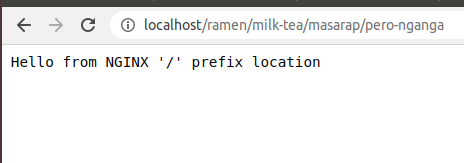
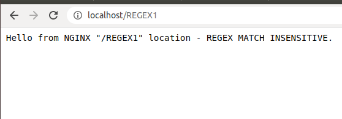
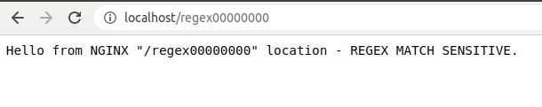
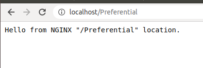
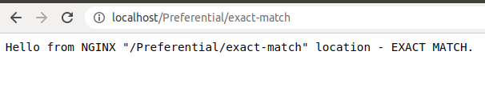
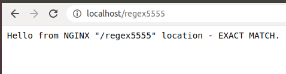

### Prioritization of the location matching criteria.
| # |      Matcher                  | Operation   |  Example                     |
|---| ----------------------------- | ----------- |------------------------------|
| 1 | Exact Match                   | __=__ uri   | location = /greet            |
| 2 | Preferential Prefix Match     | __^~__ uri  | location ^~ /greet           |
| 3 | Regex Case Sensitive Match    | __~__ uri   | location ~ /greet/[a-zA-Z]   |
| 4 | Regex Case In-Sensitive Match | __~*__ uri  | location ~* /greet/[a-zA-Z]  |
| 5 | Prefix Match                  | uri         | location /greet              |

#### Start the container
> Make sure that you're under __/2. Location Blocks__

```
$ docker-compose up -d 
  Creating network "2locationblocks_app_network" with the default driver
  Creating sdc-nginx ... done

$ docker ps
  CONTAINER ID        IMAGE                   COMMAND                  CREATED             STATUS              PORTS                NAMES
  4434aeb12915        butch/sdc-nginx:1.0.0   "nginx -g 'daemon of…"   17 seconds ago      Up 14 seconds       0.0.0.0:80->80/tcp   sdc-nginx
```


#### Test NGINX

1. [Prefix Match "/"](http://localhost:80/).<br /> 
    
    All request uri that does't match to any location matcher will be routed on this.

     <br />
    

2.  [Regex Case In-Sensitive Match](http://localhost:80/ReGex0), <br />
    Regex path patterns:
      - /REGEX0    # any number after "REGEX"
      - /ReGex1    # lower case or upper case for word "regex"  
      
     <br />
    

3. [Regex Case Sensitive Match](http://localhost/regex1)<br />
    Regex path pattern: /regex0. Any number after word "regex" 
    
    <br/>
    > Regex Sensitive Match will take precedence over in-sensitive regex match.
    
4. [Preferential Prefix Match](http://localhost:80/Preferential) <br />
    This is the same with prefix match, but it will take precedence over regex and prefix match.
    
    
    
5. [Exact Match](http://localhost:80/Preferential/exact-match) <br />
    <br />
      
                                                                                                                                                                                                     


#### To stop & remove the container
> Make sure that you're under __/2. Location Blocks__
```
$ docker-compose down
  Stopping sdc-nginx ... done
  Removing sdc-nginx ... done
  Removing network 2locationblocks_app_network
```
