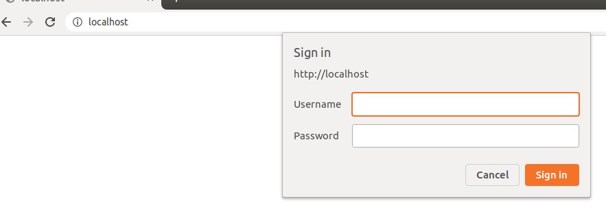
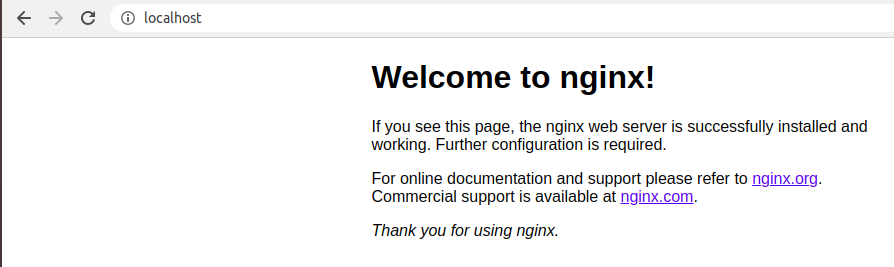
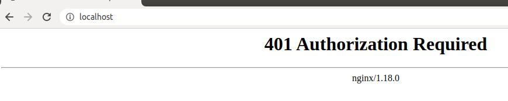

#### Basic Authentication in NGINX
>  It uses username and password for authentication.

#### Start the container
> Make sure the you're under __ __
```
$ docker-compose up -d
  Creating network "4basicauth_app_network" with the default driver
  Creating sdc-nginx-basic-auth ... done

$ docker ps 
  CONTAINER ID        IMAGE                  COMMAND                  CREATED             STATUS              PORTS                NAMES
  85404462d479        4basicauth_sdc-nginx   "nginx -g 'daemon of…"   About an hour ago   Up About an hour    0.0.0.0:80->80/tcp   sdc-nginx-basic-auth
```


#### Test the NGINX Basic Authentication
1. Click this [link](http://localhost:80/) and there will be a prompt to input username & password.<br />
   > Enter the following: <br />
   >  - __Username:__ user <br />
   >  - __Password:__ user
                                                                                                                                                                                                                       
   

2. If you've entered a correct username & password. Then you'll see the default NGINX home page.<br />
   
   
3. If you've entered incorrect username or password, then you'll be see this page. <br />
       
   
   
#### To stop & remove the container
> Make sure that you're under __/4. Basic Auth__
``` 
$ docker-compose down
  Stopping sdc-nginx-basic-auth ... done
  Removing sdc-nginx-basic-auth ... done
  Removing network 4basicauth_app_network
```
    
   
