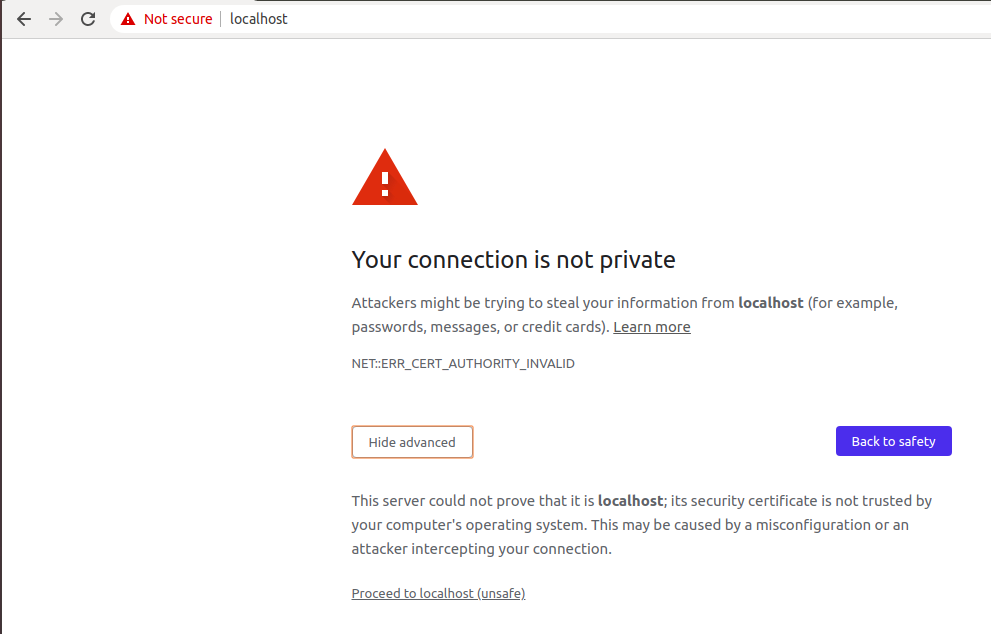
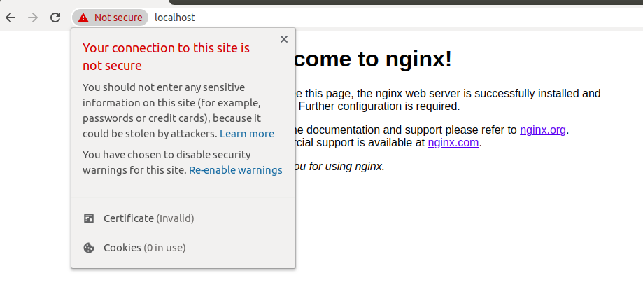

#### Generate Self-Signed Certificate 
```
 $ mkdir -p docker/ssl
 $ openssl req -x509 -days 365 -nodes -newkey rsa:2048 -keyout ./docker/ssl/self.key -out ./docker/ssl/self.crt
```

#### Create Dockerfile
```
$ mkdir -p docker/ssl
$ cd docker
$ touch Dockerfile
```

#### Paste this to the created Dockerfile
```
FROM butch/sdc-nginx:1.0.0
MAINTAINER Charlie "Butch" Santos <cusantos@globe.com.ph>
RUN mkdir -p /etc/nginx/ssl
COPY ./ssl/ /etc/nginx/ssl/
```

#### Start the container
> Make sure that you're under __/5. Https__
```
$ docker-compose up -d
  Creating network "5https_app_network" with the default driver
  Creating sdc-nginx-ssl ... done

$ docker ps
  CONTAINER ID        IMAGE               COMMAND                  CREATED              STATUS              PORTS                  NAMES
  b9f47adc6fcc        5https_sdc-nginx    "nginx -g 'daemon of…"   About a minute ago   Up About a minute   0.0.0.0:443->443/tcp   sdc-nginx-ssl
```

#### Test NGINX 
1.  Click this [link](https://localhost:443) and there will be a prompt to accept or verify the certificate. This is expected since we've use self-signed certificate. <br />
     <br /> 
    
    > Click "Proceed to localhost(unsafe)."

2.  Then you'll be directed in the NGINX default home page. <br />
    


#### To stop & remove the container
> Make sure that you're under __/5. Https__
```
$ docker-compose down
  Stopping sdc-nginx-ssl ... done
  Removing sdc-nginx-ssl ... done
  Removing network 5https_app_network
```

