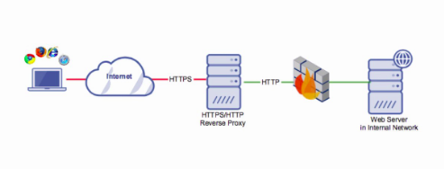
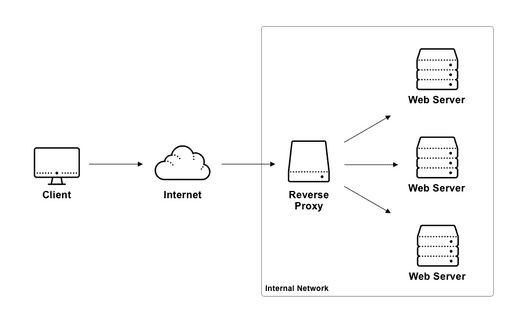

#### Reverse Proxy

 > Is a type of proxy server that retrieves resources on behalf of a client from one or more servers. These resources are then returned to the client, appearing as if they originated from the proxy server itself. 

#### Load Balancer

 >  Is a device that acts as a reverse proxy and distributes network or application traffic across a number of servers. Load balancers are used to increase capacity (concurrent users) and reliability of applications.

##### SOURCE CODE
 - nginx.conf
    ```
    # to get the number of core cpu, run this command: lscpu and check for CPU(s)
    worker_processes auto;
    
    events {
       # to get the exact worker_connection use this command: ulimit -n
       worker_connections  1024;
    }
    
    http {
        include mime.types;
    
        upstream node_servers {
            # Uncomment this to enable sticky session.
            # ip_hash;
    
            # Uncomment this to enable load balancing to least connection.
            # least_conn;
    
            server sdc-node-app1;
            server sdc-node-app2;
        }
    
        server {
            listen 80;
    
            location /app1 {
                proxy_set_header Host $host;
                proxy_set_header X-Real-IP $remote_addr;
                rewrite ^/app1 / break;
                proxy_pass "http://sdc-node-app1";
            }
    
            location /app2 {
                proxy_set_header Host $host;
                proxy_set_header X-Real-IP $remote_addr;
                proxy_pass "http://sdc-node-app2/";
            }
    
            location = /app {
                proxy_pass http://node_servers/;
            }
        }
    }
    ```
 - docker-compose.yaml
    ```
    version: '3.3'
    
    services:
      sdc-nginx:
        image: butch/sdc-nginx:1.0.0
        container_name: sdc-nginx
        volumes:
          - ./nginx.conf:/etc/nginx/nginx.conf:ro
        ports:
          - 80:80
        networks:
          - app_network
    
      sdc-node-app1:
        build:
          context: ./apps/nodejs
        container_name: sdc-node-app1
        networks:
          - app_network
        environment:
          - AppName=sdc-node-app1
    
      sdc-node-app2:
        build:
          context: ./apps/nodejs
        container_name: sdc-node-app2
        networks:
          - app_network
        environment:
          - AppName=sdc-node-app2
    
      sdc-node-app3:
        build:
          context: ./apps/nodejs
        container_name: sdc-node-app3
        networks:
          - app_network
        environment:
          - AppName=sdc-node-app3
    
    networks:
      app_network:
    ```
 - apps/nodejs
    - Dockerfile
        ```
        FROM node:lts-alpine3.12
        MAINTAINER Charlie Santos
        WORKDIR /app
        COPY . .
        RUN npm install
        EXPOSE 80
        CMD ["npm", "run", "deploy"]
        ```
    - package.json
      ```
       {
         "name": "nodejs",
         "version": "1.0.0",
         "description": "NodeJS Express Example Demo",
         "main": "index.js",
         "scripts": {
           "deploy": "node index.js"
         },
         "author": "cusantos@globe.com.ph",
         "license": "ISC",
         "dependencies": {
           "express": "^4.17.1",
           "os": "^0.1.1"
         }
       }
      ``` 
      
     - index.js
       ```
       const express = require('express');
       const os = require('os');
       const app = express();
       const port = 80;
       
       app.get('/', (req, res) => {
           res.type('application/json');
           res.jsonp({
               date: new Date(),
               hostName: os.hostname() || "Can't get actual hostname",
               appName:  process.env.AppName || "ExpressJs Example App",
               httpMethod: req.method || "Can't get HTTP Verb",
               endpoint: req.path || "Can't get request path.",
               queryParams: [req.query || "No Query params"]
           });
       });
       
       app.listen(port, () => console.log(`Example app listening at http://localhost:${port}`));
       ```
##### Start the containers
```
$ docker-compose up -d --build
  Creating network "8reverseproxyloadbalancer_app_network" with the default driver
  Building sdc-node-app2
  Step 1/7 : FROM node:lts-alpine3.12
   ---> e3c8de5f19c8
  Step 2/7 : MAINTAINER Charlie Santos
   ---> Using cache
   ---> 9e236bbc9ab1
  Step 3/7 : WORKDIR /app
   ---> Using cache
   ---> ba71007b49d2
  Step 4/7 : COPY . .
   ---> Using cache
   ---> 9d7489ef8a7d
  Step 5/7 : RUN npm install
   ---> Using cache
   ---> b031c767d823
  Step 6/7 : EXPOSE 80
   ---> Using cache
   ---> 9f7fb07a2505
  Step 7/7 : CMD ["npm", "run", "deploy"]
   ---> Using cache
   ---> 1dd07af37ab9
  
  Successfully built 1dd07af37ab9
  Successfully tagged 8reverseproxyloadbalancer_sdc-node-app2:latest
  Building sdc-node-app1
  Step 1/7 : FROM node:lts-alpine3.12
   ---> e3c8de5f19c8
  Step 2/7 : MAINTAINER Charlie Santos
   ---> Using cache
   ---> 9e236bbc9ab1
  Step 3/7 : WORKDIR /app
   ---> Using cache
   ---> ba71007b49d2
  Step 4/7 : COPY . .
   ---> Using cache
   ---> 9d7489ef8a7d
  Step 5/7 : RUN npm install
   ---> Using cache
   ---> b031c767d823
  Step 6/7 : EXPOSE 80
   ---> Using cache
   ---> 9f7fb07a2505
  Step 7/7 : CMD ["npm", "run", "deploy"]
   ---> Using cache
   ---> 1dd07af37ab9
  
  Successfully built 1dd07af37ab9
  Successfully tagged 8reverseproxyloadbalancer_sdc-node-app1:latest
  Building sdc-node-app3
  Step 1/7 : FROM node:lts-alpine3.12
   ---> e3c8de5f19c8
  Step 2/7 : MAINTAINER Charlie Santos
   ---> Using cache
   ---> 9e236bbc9ab1
  Step 3/7 : WORKDIR /app
   ---> Using cache
   ---> ba71007b49d2
  Step 4/7 : COPY . .
   ---> Using cache
   ---> 9d7489ef8a7d
  Step 5/7 : RUN npm install
   ---> Using cache
   ---> b031c767d823
  Step 6/7 : EXPOSE 80
   ---> Using cache
   ---> 9f7fb07a2505
  Step 7/7 : CMD ["npm", "run", "deploy"]
   ---> Using cache
   ---> 1dd07af37ab9
  
  Successfully built 1dd07af37ab9
  Successfully tagged 8reverseproxyloadbalancer_sdc-node-app3:latest
  Creating sdc-nginx ... done
  Creating sdc-node-app2 ... 
  Creating sdc-nginx ... 
  Creating sdc-node-app3 ... 

$ docker ps
  CONTAINER ID        IMAGE                                     COMMAND                  CREATED             STATUS              PORTS                NAMES
  e13f990e5c3c        8reverseproxyloadbalancer_sdc-node-app2   "docker-entrypoint.s…"   56 seconds ago      Up 49 seconds       80/tcp               sdc-node-app2
  099324dc42fe        8reverseproxyloadbalancer_sdc-node-app3   "docker-entrypoint.s…"   56 seconds ago      Up 50 seconds       80/tcp               sdc-node-app3
  50b119208b39        8reverseproxyloadbalancer_sdc-node-app1   "docker-entrypoint.s…"   56 seconds ago      Up 50 seconds       80/tcp               sdc-node-app1
  052e990c32c4        butch/sdc-nginx:1.0.0                     "nginx -g 'daemon of…"   56 seconds ago      Up 47 seconds       0.0.0.0:80->80/tcp   sdc-nginx
```     

##### Test NGINX Reverse Proxy
```
$  curl http://localhost:80/app1?param1=1&param2=2 | jq
     % Total    % Received % Xferd  Average Speed   Time    Time     Time  Current
                                    Dload  Upload   Total   Spent    Left  Speed
   100   165  100   165    0     0  27500      0 --:--:-- --:--:-- --:--:-- 27500
   {
     "date": "2020-06-10T07:14:10.837Z",
     "hostName": "50b119208b39",
     "appName": "sdc-node-app1",
     "httpMethod": "GET",
     "endpoint": "/",
     "queryParams": [
       {
         "param1": "1",
         "param2": "2"
       }
     ]
   }

$ curl http://localhost:80/app1?param1=1&param2=2 | jq
  % Total    % Received % Xferd  Average Speed   Time    Time     Time  Current
                                   Dload  Upload   Total   Spent    Left  Speed
  100   165  100   165    0     0  55000      0 --:--:-- --:--:-- --:--:-- 55000
  {
    "date": "2020-06-10T07:16:21.293Z",
    "hostName": "e13f990e5c3c",
    "appName": "sdc-node-app2",
    "httpMethod": "GET",
    "endpoint": "/",
    "queryParams": [
      {
        "param1": "1",
        "param2": "2"
      }
    ]
  }

```

##### Test NGINX Load Balancer
```
$ while sleep 1; do curl http://localhost:80/app | jq; done
    % Total    % Received % Xferd  Average Speed   Time    Time     Time  Current
                                   Dload  Upload   Total   Spent    Left  Speed
  100   140  100   140    0     0  70000      0 --:--:-- --:--:-- --:--:-- 70000
  {
    "date": "2020-06-10T07:21:35.876Z",
    "hostName": "50b119208b39",
    "appName": "sdc-node-app1",
    "httpMethod": "GET",
    "endpoint": "/",
    "queryParams": [
      {}
    ]
  }
    % Total    % Received % Xferd  Average Speed   Time    Time     Time  Current
                                   Dload  Upload   Total   Spent    Left  Speed
  100   140  100   140    0     0  70000      0 --:--:-- --:--:-- --:--:-- 70000
  {
    "date": "2020-06-10T07:21:36.895Z",
    "hostName": "e13f990e5c3c",
    "appName": "sdc-node-app2",
    "httpMethod": "GET",
    "endpoint": "/",
    "queryParams": [
      {}
    ]
  }
    % Total    % Received % Xferd  Average Speed   Time    Time     Time  Current
                                   Dload  Upload   Total   Spent    Left  Speed
  100   140  100   140    0     0  70000      0 --:--:-- --:--:-- --:--:-- 70000
  {
    "date": "2020-06-10T07:21:37.914Z",
    "hostName": "50b119208b39",
    "appName": "sdc-node-app1",
    "httpMethod": "GET",
    "endpoint": "/",
    "queryParams": [
      {}
    ]
  }
    % Total    % Received % Xferd  Average Speed   Time    Time     Time  Current
                                   Dload  Upload   Total   Spent    Left  Speed
  100   140  100   140    0     0  70000      0 --:--:-- --:--:-- --:--:-- 70000
  {
    "date": "2020-06-10T07:21:38.932Z",
    "hostName": "e13f990e5c3c",
    "appName": "sdc-node-app2",
    "httpMethod": "GET",
    "endpoint": "/",
    "queryParams": [
      {}
    ]
  }
  
    % Total    % Received % Xferd  Average Speed   Time    Time     Time  Current
                                   Dload  Upload   Total   Spent    Left  Speed
  100   140  100   140    0     0  23333      0 --:--:-- --:--:-- --:--:-- 23333
  {
    "date": "2020-06-10T07:21:39.965Z",
    "hostName": "50b119208b39",
    "appName": "sdc-node-app1",
    "httpMethod": "GET",
    "endpoint": "/",
    "queryParams": [
      {}
    ]
  }
```

##### Stop the Containers
```
$ docker-compose down
  Stopping sdc-node-app2 ... done
  Stopping sdc-node-app3 ... done
  Stopping sdc-node-app1 ... done
  Stopping sdc-nginx     ... done
  Removing sdc-node-app2 ... done
  Removing sdc-node-app3 ... done
  Removing sdc-node-app1 ... done
  Removing sdc-nginx     ... done
  Removing network 8reverseproxyloadbalancer_app_network
```
